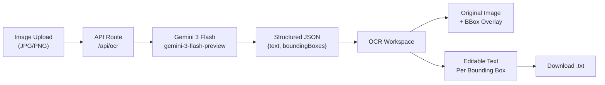

# Classical Chinese OCR Web App

## Tech Stack

- **Framework**: Next.js 15 (App Router) with TypeScript
- **UI**: shadcn/ui + Tailwind CSS
- **OCR Backend**: Google Gemini API (`gemini-3-flash-preview`) via `@google/generative-ai` npm package
- **State**: React state (no external store needed for this scope)
- **Skills**: `vercel-labs/agent-skills` (web-design-guidelines, vercel-react-best-practices, vercel-composition-patterns)

## Project Structure

```
/Users/hiepnp/build/hy-ocr/
├── app/
│   ├── layout.tsx              # Root layout with font + metadata
│   ├── page.tsx                # Main app page (upload + OCR workspace)
│   ├── api/
│   │   └── ocr/
│   │       └── route.ts        # POST endpoint: send image to Gemini, return OCR results with bounding boxes
│   └── globals.css
├── components/
│   ├── image-upload.tsx         # Drag-and-drop image upload (JPG/PNG)
│   ├── ocr-workspace.tsx        # Side-by-side: original image + OCR text overlay
│   ├── bounding-box-overlay.tsx # Canvas/SVG overlay rendering bounding boxes on the image
│   ├── text-editor.tsx          # Editable text panel with per-box editing
│   └── download-button.tsx      # Export corrected text as .txt
├── lib/
│   ├── gemini.ts               # Gemini API client setup + OCR prompt engineering
│   └── types.ts                # Shared types (OCRResult, BoundingBox, etc.)
├── .env.local                  # GOOGLE_GEMINI_API_KEY
├── package.json
├── tailwind.config.ts
├── tsconfig.json
└── next.config.ts
```

## Architecture / Data Flow




## Key Implementation Details

### 1. Gemini OCR API Route (`app/api/ocr/route.ts`)

- Accepts POST with base64-encoded image
- Sends image to Gemini with a structured prompt requesting JSON output:
  - Each detected text region returns: `{ text, bbox: { x, y, width, height } }` (proportional 0.000–1.000 of image dimensions, 3 decimal places)
  - Prompt specifically tuned for classical/traditional Chinese characters
- Returns structured JSON response to the client

### 2. Bounding Box Overlay (`components/bounding-box-overlay.tsx`)

- Renders an SVG/canvas overlay on top of the original image
- Each bounding box is clickable and highlights the corresponding text in the editor
- Boxes are color-coded (default vs. selected vs. edited)
- Coordinates are proportional (0.000–1.000) — multiplied by displayed image dimensions for pixel positioning

### 3. Side-by-Side Workspace (`components/ocr-workspace.tsx`)

- Left panel: original image with bounding box overlay (zoomable, pannable)
- Right panel: list of detected text blocks, each editable via an inline input
- Clicking a box on the image scrolls to and highlights the corresponding text block
- Clicking a text block highlights the corresponding bounding box on the image

### 4. Text Editing and Download

- Each text block is an editable `<textarea>` or shadcn `Input`
- Changes are tracked in React state
- "Download as .txt" button concatenates all (possibly edited) text blocks and triggers a file download
- Option to copy all text to clipboard

## Setup Steps

1. Create project folder at `/Users/hiepnp/build/hy-ocr/`, init git repo
2. Install skills: `npx skills add vercel-labs/agent-skills -g -y`
3. Scaffold Next.js app with TypeScript + Tailwind
4. Initialize shadcn/ui
5. Install `@google/generative-ai` for Gemini API
6. Build the components and API route
7. Create `.env.local` template for `GOOGLE_GEMINI_API_KEY`

