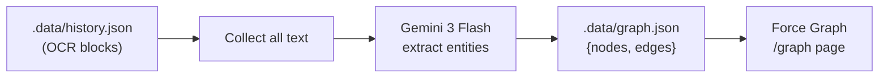

# Knowledge Graph from OCR Text — MVP

## Approach

LLM-powered entity extraction from OCR text + lightweight client-side graph visualization.

### Why this approach

- **No NLP pipeline** — no spaCy, no custom NER training for classical Chinese
- **No graph database** — just a JSON file (`.data/graph.json`)
- **Gemini already understands classical Chinese** — it can extract entities and infer relationships
- **Gemini client already wired up** in `lib/gemini.ts`

## Pipeline

1. **Extract** — Collect all OCR text from all history entries → send to Gemini with structured prompt → get `{nodes: [...], edges: [...]}`
2. **Store** — Save to `.data/graph.json`
3. **Visualize** — `react-force-graph-2d` force-directed graph on `/graph` page

## Data Model

```typescript
interface GraphNode {
  id: string;
  label: string;
  type: "PERSON" | "PLACE" | "WORK" | "ERA" | "TITLE" | "EVENT" | "CONCEPT";
  description?: string;
  sourceEntryIds: string[];   // which history entries this was found in
}

interface GraphEdge {
  source: string;  // node id
  target: string;  // node id
  relation: string;
  description?: string;
}

interface KnowledgeGraph {
  nodes: GraphNode[];
  edges: GraphEdge[];
  extractedAt: string;
  sourceEntryIds: string[];
}
```

## API

- `POST /api/graph` — triggers extraction from all (or selected) OCR history entries
- `GET /api/graph` — returns the stored graph JSON

## Visualization

- Interactive force-directed graph using `react-force-graph-2d`
- Nodes colored by entity type
- Click node to see details (description, source documents)
- Click edge to see relationship details
- Filter by entity type
- Search/highlight nodes

## Architecture


